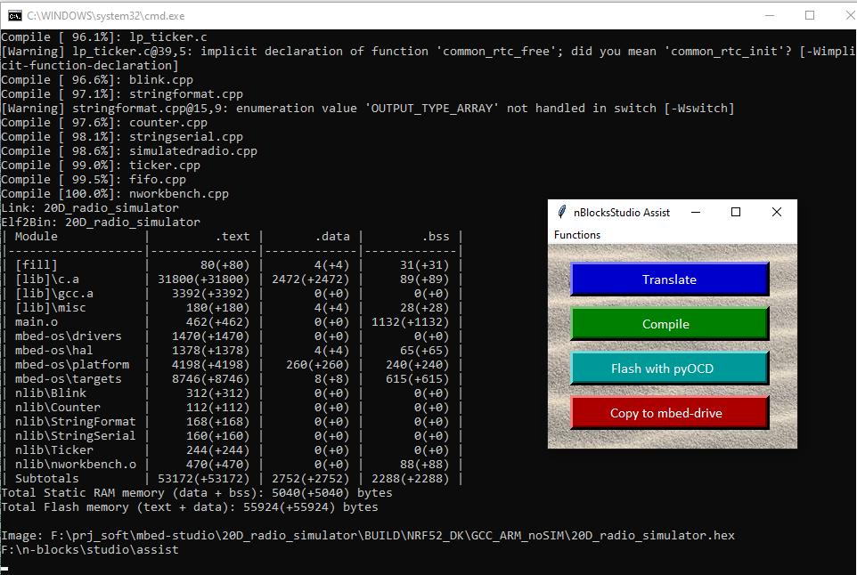
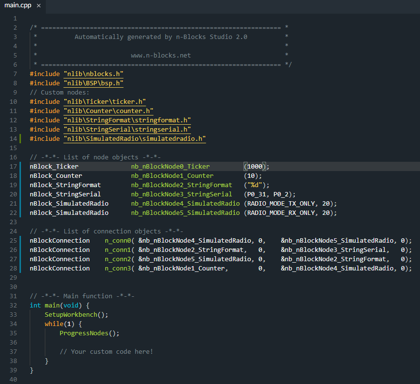

# 20D_radio_simulator_firmware

Firmware repo for [Design 20D_radio_simulator](https://github.com/nBlocksStudioApps/20D_radio_simulator)

 Simulated Design
 *  Compilation with [assist](https://github.com/nblocksStudio/assist) GCC_ARM Pass :heavy_check_mark:
 *  Compilation with [assist](https://github.com/nblocksStudio/assist) ARMC6 Pass :heavy_check_mark:
 *  Compilation with `mbed-studio` GCC_ARM Pass :heavy_check_mark:

  Non Simulated Design
 *  Compilation with `assist` GCC_ARM Pass :heavy_check_mark:
 *  Compilation with `assist` ARMC6 Pass :heavy_check_mark:
 *  Compilation with `mbed-studio` GCC_ARM Pass :heavy_check_mark:

<!-- pagebreak -->

## Compilation of the simulatedRadio Design using mBedStudio_assist

<!-- pagebreak -->

## main.cpp for the simulatedRadio Design reviewed with mbed-studio IDE

<!-- pagebreak -->

## Compilation for the simulatedRadio Design with mbed_studio

<!-- pagebreak -->

## Compilation  using nBlocksStudio_assist

Four (4) BUILD directories are created compiling two (2) Designs (SimulatedRadio and nonSimulatedRadio) with 2 different compilers.
The "GCC_ARM" build directory is created with mbed_studio. While mbed-studio is a nice IDE, with [nBlocksStudio_assist](https://github.com/nblocksStudio/assist) is easier to switch between different compilers and "BUILD directory" names.  

----